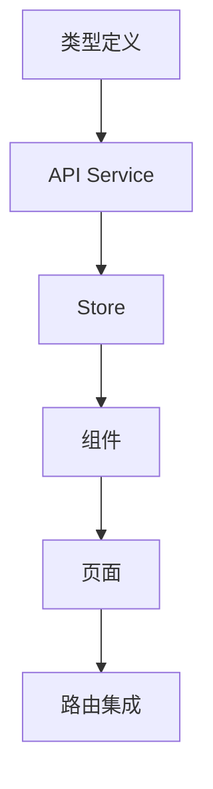

# Pod C 交付物总结 - 前端体验增强

## 任务完成情况

### Phase 1: 探索任务 [已完成]

已创建文档：`frontend-architecture-analysis.md`

**主要发现：**
1. 现有 InterviewSimulatorPage 采用单一组件多阶段管理
2. 状态管理使用 Zustand + Local State 混合模式
3. 可提取 8 个高复用价值组件
4. 需要新建 interviewStore 统一管理面试状态

**技术选型：**
- 图表库：Recharts (推荐)
- 动画库：Framer Motion (推荐)
- 状态管理：继续使用 Zustand

---

### Phase 2: 设计任务 [已完成]

已创建文档：`frontend-ux-spec.md`

**设计了三个新页面：**

1. **InterviewPrepPage (/interview/prep)**
   - 面试准备模式
   - 支持练习/模拟/挑战三种模式
   - 题库预览功能
   - 时间限制设置

2. **InterviewReplayPage (/interview/replay/:sessionId)**
   - 面试回放功能
   - 时间轴拖拽交互
   - 对话气泡展示
   - 支持重新回答对比

3. **ProgressDashboardPage (/progress)**
   - 进度可视化看板
   - 分数趋势图
   - 能力雷达图
   - 技术栈热力图

**API 需求：**
需要后端提供 4 个新接口：
1. GET /api/interview/question-preview
2. GET /api/interview/{session_id}/replay
3. GET /api/user/progress/dashboard
4. GET /api/user/interview/stats

---

### Phase 3: 组件 API 契约 [已完成]

已创建文档：`component-api-contract.md`

**定义了：**
- 8 个可复用组件的 Props 接口
- 3 个页面组件的状态管理
- 2 个 Zustand Store 的完整 API
- 类型定义扩展

---

## 交付物清单

- [x] frontend-architecture-analysis.md (架构分析报告)
- [x] frontend-ux-spec.md (UX 设计文档)
- [x] component-api-contract.md (组件 API 契约)
- [ ] 待创建的 Git 分支：feature/phase1/pod-c-frontend-ux

---

## 下一步实现建议

### 第一阶段（核心功能）
1. 扩展 types/index.ts 添加新类型定义
2. 扩展 services/api.ts 添加新 API 方法
3. 创建基础组件（TechStackSelector, ModeSelector 等）
4. 创建 useInterviewStore
5. 实现 InterviewPrepPage

### 第二阶段（回放功能）
6. 创建 ReplayTimeline 组件
7. 创建 ChatBubble 组件
8. 实现 InterviewReplayPage

### 第三阶段（Dashboard）
9. 创建图表组件（使用 Recharts）
10. 创建 useDashboardStore
11. 实现 ProgressDashboardPage

### 第四阶段（集成测试）
12. 路由配置
13. 响应式测试
14. 无障碍访问测试

---

## 预计工作量

- 类型和 API 扩展：1-2 小时
- 组件开发：4-5 小时
- 页面实现：3-4 小时
- 测试优化：2-3 小时
- **总计：10-14 小时**

---

## 关键技术点

1. **状态管理**：使用 Zustand 统一管理，支持持久化
2. **图表库**：Recharts，与 Ant Design 风格一致
3. **动画**：Framer Motion，支持手势和拖拽
4. **响应式**：移动端优先，768px 和 1024px 断点
5. **无障碍**：键盘导航和屏幕阅读器支持

---

## 依赖关系

---

## 成功标准

1. 用户可以进入准备模式选择面试配置
2. 用户可以查看历史面试的回放
3. 用户可以在 Dashboard 查看进步轨迹
4. 所有页面无障碍访问通过
5. 移动端响应式布局正常
6. 性能指标：首屏加载 < 2s

---

## 联系信息

如有疑问，请参考：
- 架构报告：frontend-architecture-analysis.md
- UX 设计：frontend-ux-spec.md
- API 契约：component-api-contract.md
