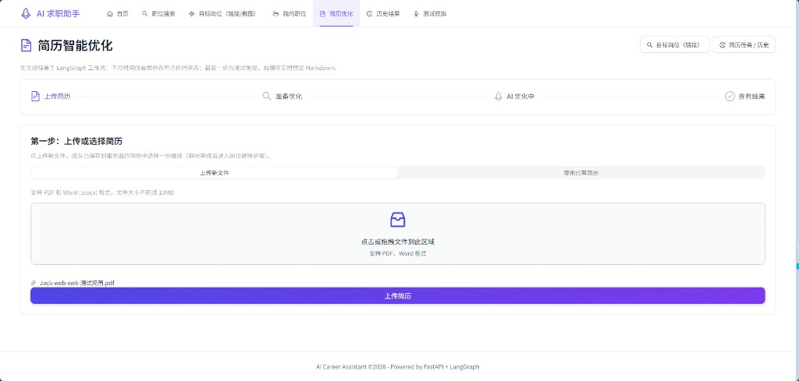
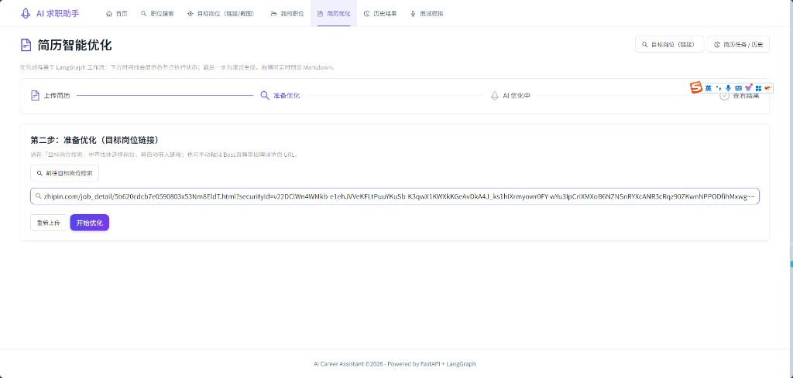
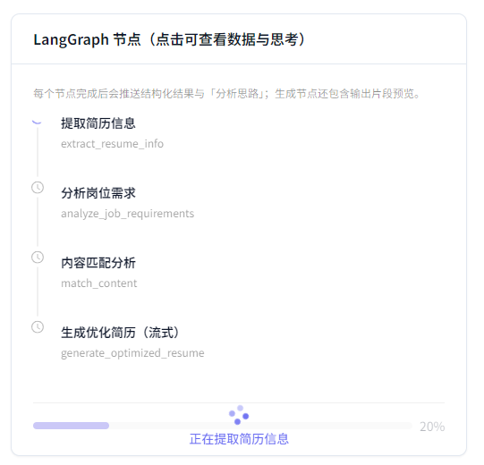
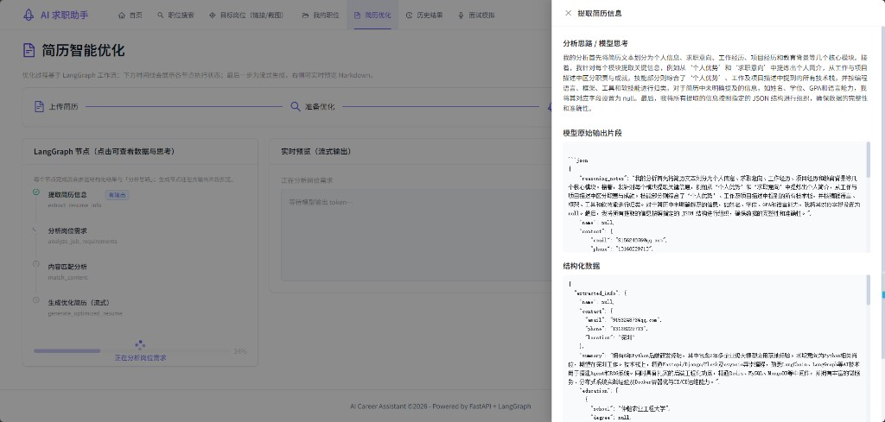
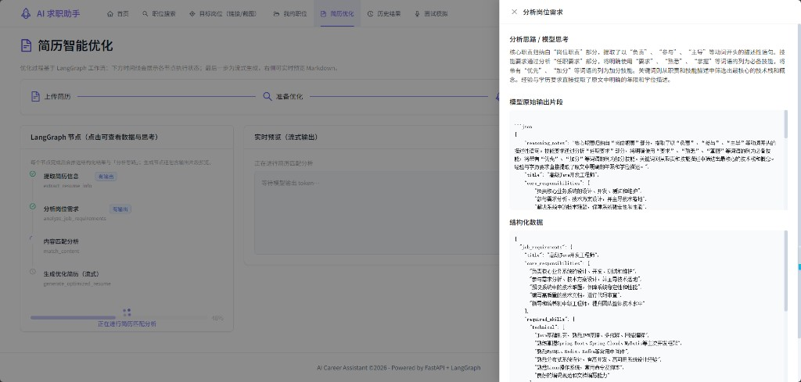
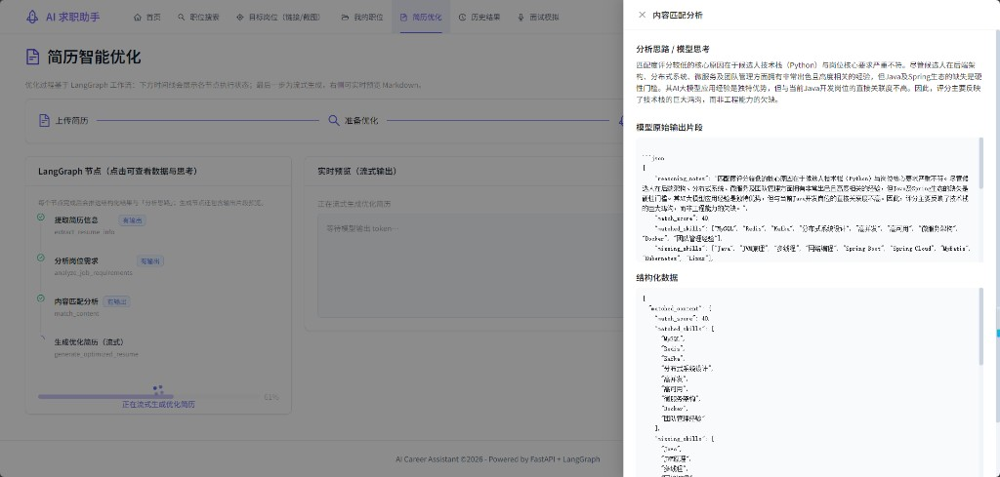
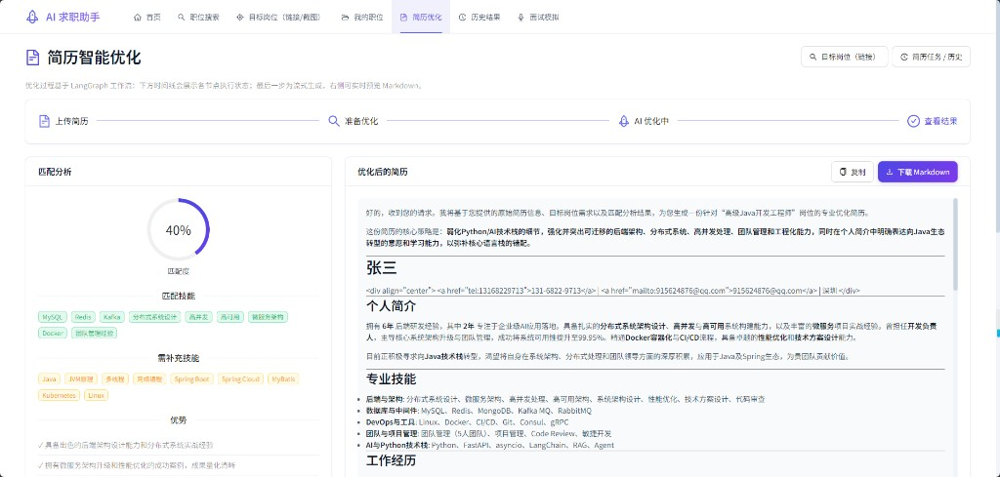

# AI 求职助手 (AI Career Assistant)

基于 FastAPI + LangGraph 的轻量级 AI 求职工具，实现**简历智能优化**和**语音技术面试模拟**两大核心功能。

## 🚀 核心功能

### 1. 简历智能优化
- 上传 PDF/Word 格式简历
- 输入目标岗位链接（支持 Boss直聘）
- AI 自动提取简历信息，分析岗位需求
- 基于 STAR 法则生成优化后的简历
- 支持 Markdown 格式下载

### 2. 语音技术面试模拟
- 选择目标岗位和技术栈
- AI 面试官实时语音交互
- 语音转文字 (Whisper) + 文字转语音 (TTS)
- 面试结束后生成评估报告

### 3. 职位搜索（MVP）
- 前端 `/jobs`：关键词、公司名、城市、数据源（Boss / 智联 / 鱼泡）、排序与分页
- 后端 `POST /api/jobs/search` 聚合多源列表，进程内 **TTL 缓存**（默认约 5 分钟）
- **限流**：每客户端 IP 每分钟最多 **10 次** 搜索请求，超出返回 `429` 与 `Retry-After`
- **合规**：各站服务条款与反爬策略不同，本功能仅供学习/自用；请合理设置请求间隔并遵守 `robots.txt`

## 📸 界面演示（简历智能优化）

以下为「简历智能优化」流程与 LangGraph 可观测性示意。截图仅作文档说明，界面与数据以实际运行为准；资源目录：`docs/codebase/images/`。

**路径与渲染**：图片使用相对本文件（仓库根目录 `README.md`）的路径 `docs/codebase/images/...`，与 **GitHub 仓库主页**解析方式一致，**推送到 GitHub 后表格内截图可正常显示**。部分编辑器自带的 Markdown Preview 对「表格 + 内嵌图片」支持不完整，若本地看不到图，可直接打开 `docs/codebase/images/` 下对应 PNG，或以 GitHub 网页为准。

### 流程：上传 → 目标岗位 → 节点执行

| 说明 | 截图 |
| --- | --- |
| **第一步**：上传或选择简历（PDF / Word） |  |
| **第二步**：准备优化（目标岗位链接，可来自应用内搜索或粘贴招聘站链接） |  |
| **LangGraph 节点与进度**（节点可点击「看输出」查看结构化结果与「分析思路」） |  |

### LangGraph 节点与可观测性

「简历智能优化」由 **LangGraph** 编排多条节点顺序执行；前端在节点时间线上展示进度，并支持点击 **「看输出」** 打开侧栏，查看该节点的 **分析思路 / 模型思考**、**模型原始输出片段** 与 **结构化数据**，便于理解各步在做什么、中间态如何传给下一步。

| 截图文件 | 对应节点（后端名） | 说明 |
| --- | --- | --- |
| `demo-agent-node-extract-resume-info.png` | `extract_resume_info` | 从简历抽取联系信息、摘要、教育等结构化 JSON |
| `demo-agent-node-analyze-job-requirements.png` | `analyze_job_requirements` | 从岗位描述抽取职责、必备技能等 |
| `demo-agent-node-match-content.png` | `match_content` | 简历与岗位的匹配分、已匹配/缺失技能等 |
| `demo-resume-step4-results.png` | （结果页） | 左侧匹配度与标签，右侧优化稿与复制/下载 |

| 说明 | 截图 |
| --- | --- |
| **`extract_resume_info`**：侧栏展示思路、原始片段与结构化数据 |  |
| **`analyze_job_requirements`**：岗位需求结构化 |  |
| **`match_content`**：匹配分与缺项技能（示例数据） |  |
| **第四步「查看结果」**：匹配分析总览与优化后简历预览 |  |

## 🛠️ 技术栈

| 层级 | 技术 |
|------|------|
| 后端框架 | FastAPI 0.115+ |
| AI 框架 | LangGraph 0.2+, LangChain 0.3+ |
| 简历解析 | pdfplumber, python-docx |
| 数据爬取 | requests, BeautifulSoup4 |
| 语音处理 | OpenAI Whisper, OpenAI TTS |
| 大模型 | OpenAI GPT-4o-mini |
| 数据库 | SQLite + SQLAlchemy 2.0+ |
| 前端 | React 18 + TypeScript + Ant Design |

## 📁 目录结构

```
ai-career-assistant/
├── backend/                 # 后端代码
│   ├── app/                 # 核心应用
│   │   ├── api/             # API 路由
│   │   ├── core/            # 配置、安全、工具
│   │   ├── models/          # 数据模型
│   │   ├── services/        # 业务逻辑
│   │   ├── agents/          # LangGraph 智能体
│   │   └── utils/           # 通用工具
│   ├── tests/               # 测试代码
│   ├── scripts/             # 脚本
│   ├── .env.example         # 环境变量示例
│   ├── requirements.txt     # 依赖
│   └── main.py              # 后端入口
├── frontend/                # 前端代码
│   ├── src/
│   │   ├── pages/           # 页面
│   │   ├── components/      # 组件
│   │   └── services/        # API 调用
│   └── package.json
├── docs/                    # 文档
└── README.md                # 项目总览
```

## 🚀 快速开始

### 环境要求
- Python 3.11+
- Node.js 18+ (前端)
- OpenAI API Key

### 后端启动

```bash
# 进入后端目录
cd backend

# 创建虚拟环境
python -m venv venv
source venv/bin/activate  # Windows: venv\Scripts\activate

# 安装依赖
pip install -r requirements.txt

# 配置环境变量
cp env.example .env
# 编辑 .env 文件，填入 OPENAI_API_KEY

# 初始化数据库
python scripts/init_db.py

# 启动服务
python main.py
```

### 前端启动

```bash
# 进入前端目录
cd frontend

# 安装依赖
npm install

# 启动开发服务器
npm run dev
```

### 访问地址
- 后端 API: http://localhost:8000
- API 文档: http://localhost:8000/docs
- 前端: http://localhost:5173

## 📝 API 接口

### 简历优化
- `POST /api/resume/upload` - 上传简历文件
- `POST /api/resume/optimize` - 优化简历
- `GET /api/resume/{id}/download` - 下载优化后的简历

### 面试模拟
- `POST /api/interview/start` - 开始面试
- `WebSocket /api/interview/ws/{session_id}` - 实时语音交互
- `GET /api/interview/{session_id}/report` - 获取面试报告

### 职位搜索
- `POST /api/jobs/search` - 多源职位列表聚合搜索（见环境变量 `JOB_SEARCH_*`）

## ⚠️ 注意事项

1. **API Key 安全**: 请勿将 `.env` 文件提交到版本控制
2. **爬虫合规**: 爬取功能仅用于学习，请遵守网站 robots.txt；职位列表聚合请勿高频请求外站
3. **职位搜索限流**: 默认每 IP 每分钟 10 次（`JOB_SEARCH_RATE_LIMIT_PER_MINUTE`）
4. **音频权限**: 使用面试功能需要浏览器麦克风权限

## 📄 开源协议

MIT License

## 🤝 贡献指南

欢迎提交 Issue 和 Pull Request！
