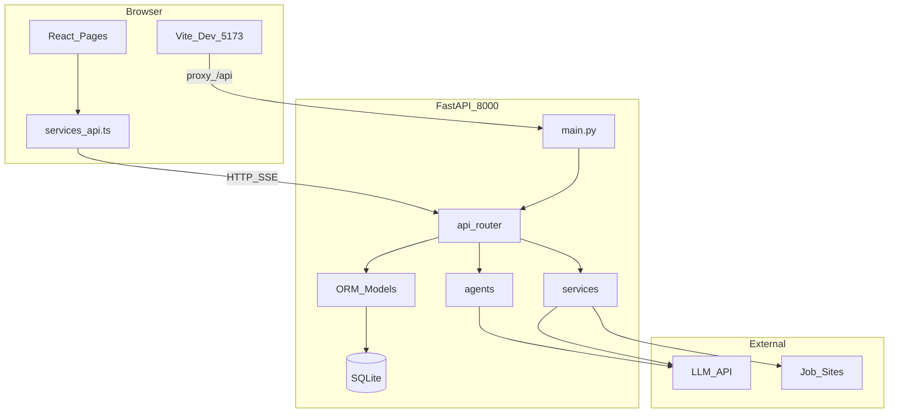

# 架构总览（归纳）

本文档**不重复**各文件细节，细节见 [codebase/](codebase/) 下逐文件概要；阅读顺序见 [reading-roadmap.md](reading-roadmap.md)。

## 模块依赖简图

## 用户主路径（业务）

1. **简历优化**  
   用户上传或选择已有简历 → `POST /api/resume/upload` 或 `GET /api/resume/{id}` → 填岗位 URL（可来自职位库或粘贴）→ `POST /api/resume/optimize/{id}/stream`（SSE，LangGraph 多节点）→ 结果落库与 Markdown 下载。  
   关键后端：[codebase/backend/app/api/resume.md](codebase/backend/app/api/resume.md)、[codebase/backend/app/agents/resume_optimizer_agent.md](codebase/backend/app/agents/resume_optimizer_agent.md)。

2. **模拟面试**  
   配置岗位与技术栈 → `POST /api/interview/start` → 多轮答题（音频经 Whisper 等）→ 报告持久化 → 历史页查看。  
   关键后端：[codebase/backend/app/api/interview.md](codebase/backend/app/api/interview.md)、[codebase/backend/app/agents/interview_agent.md](codebase/backend/app/agents/interview_agent.md)。

3. **职位搜索 / 保存 / 链接爬取**  
   关键词搜索 → `POST /api/jobs/search`（多源聚合、限流、可选缓存）→ 保存 → `POST /api/jobs/saved`；单 URL → `POST /api/jobs/scrape-url` 入库。  
   关键后端：[codebase/backend/app/api/jobs.md](codebase/backend/app/api/jobs.md)、[codebase/backend/app/services/job_search/aggregator.md](codebase/backend/app/services/job_search/aggregator.md)。

## 配置与环境

| 项 | 说明 |
|----|------|
| 后端端口 | 默认 `8000`（见 [codebase/backend/main.md](codebase/backend/main.md)） |
| 前端开发 | Vite `5173`，`vite.config` 将 `/api` 代理到后端（见 [codebase/frontend/src/services/api.md](codebase/frontend/src/services/api.md)） |
| 环境变量 | `OPENAI_API_KEY`、`DATABASE_URL`、`UPLOAD_DIR`、CORS 等（见 [codebase/backend/app/core/config.md](codebase/backend/app/core/config.md)） |
| OpenAPI | 运行后访问 `/docs` |

## 日志与错误

全局异常与 422 记录见 [codebase/backend/app/core/exception_handlers.md](codebase/backend/app/core/exception_handlers.md)；前端统一解析 `detail` 见 [codebase/frontend/src/services/api.md](codebase/frontend/src/services/api.md)。

## 索引

| 类型 | 位置 |
|------|------|
| 阅读路线图（含勾选表） | [reading-roadmap.md](reading-roadmap.md) |
| 逐文件概要根目录 | [codebase/README.md](codebase/README.md) |
| 后端入口 | [codebase/backend/main.md](codebase/backend/main.md) |
| API 聚合 | [codebase/backend/app/api/__init__.md](codebase/backend/app/api/__init__.md) |
| 前端路由 | [codebase/frontend/src/App.md](codebase/frontend/src/App.md) |

## 测试与脚本

- 职位搜索单测：[codebase/backend/test_job_search.md](codebase/backend/test_job_search.md)  
- 面试 Agent 脚本：[codebase/backend/test_interview_agent.md](codebase/backend/test_interview_agent.md)  
- Pytest 配置：[codebase/backend/tests/conftest.md](codebase/backend/tests/conftest.md)  
- 本地启动：[codebase/root/start-services.md](codebase/root/start-services.md)
