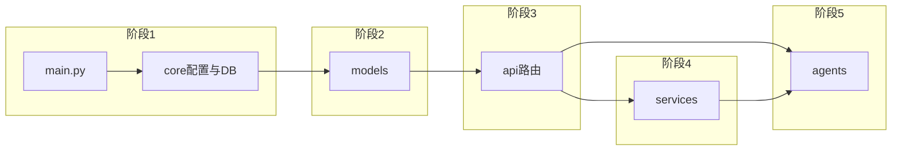

# 代码阅读路线图

按**依赖由外到内**阅读；每阶段内的顺序即建议顺序。勾选表示已完成阅读（执行者自用）。

**文档镜像**：源码 `path/to/file.ext` 对应概要 [`codebase/path/to/file.md`](codebase/)（扩展名改为 `.md`）。根目录脚本见 [codebase/root/](codebase/root/)。

**薄 `__init__.py` 合并规则**：[`backend/app/__init__.py`](../backend/app/__init__.py) 仅版本号，合并写入 [`codebase/backend/app/__init__.md`](codebase/backend/app/__init__.md)；其余包级 `__init__.py` 若仅为 re-export，在同一篇 `__init__.md` 中分小节说明，不单独拆多文件。

---

## 阶段 0：总览（可选优先读）

| 前置 | 文档 |
|------|------|
| 无 | [ARCHITECTURE_SUMMARY.md](ARCHITECTURE_SUMMARY.md) |

---

## 阶段 1：入口与核心配置

**前置**：无（从 `main.py` 开始）。

| 状态 | 源码 | 概要文档 |
|------|------|----------|
| [ ] | `backend/main.py` | [codebase/backend/main.md](codebase/backend/main.md) |
| [ ] | `backend/app/core/config.py` | [codebase/backend/app/core/config.md](codebase/backend/app/core/config.md) |
| [ ] | `backend/app/core/database.py` | [codebase/backend/app/core/database.md](codebase/backend/app/core/database.md) |
| [ ] | `backend/app/core/exception_handlers.py` | [codebase/backend/app/core/exception_handlers.md](codebase/backend/app/core/exception_handlers.md) |
| [ ] | `backend/app/core/rate_limit.py` | [codebase/backend/app/core/rate_limit.md](codebase/backend/app/core/rate_limit.md) |
| [ ] | `backend/app/core/llm_provider.py` | [codebase/backend/app/core/llm_provider.md](codebase/backend/app/core/llm_provider.md) |
| [ ] | `backend/app/core/dependencies.py` | [codebase/backend/app/core/dependencies.md](codebase/backend/app/core/dependencies.md) |
| [ ] | `backend/app/core/exceptions.py` | [codebase/backend/app/core/exceptions.md](codebase/backend/app/core/exceptions.md) |
| [ ] | `backend/app/core/__init__.py` | [codebase/backend/app/core/__init__.md](codebase/backend/app/core/__init__.md) |

---

## 阶段 2：数据模型

**前置**：阶段 1 中的 `database.py`、`config.py`（理解 ORM 与表）。

| 状态 | 源码 | 概要文档 |
|------|------|----------|
| [ ] | `backend/app/models/user.py` | [codebase/backend/app/models/user.md](codebase/backend/app/models/user.md) |
| [ ] | `backend/app/models/resume.py` | [codebase/backend/app/models/resume.md](codebase/backend/app/models/resume.md) |
| [ ] | `backend/app/models/interview.py` | [codebase/backend/app/models/interview.md](codebase/backend/app/models/interview.md) |
| [ ] | `backend/app/models/saved_job.py` | [codebase/backend/app/models/saved_job.md](codebase/backend/app/models/saved_job.md) |
| [ ] | `backend/app/models/schemas.py` | [codebase/backend/app/models/schemas.md](codebase/backend/app/models/schemas.md) |
| [ ] | `backend/app/models/job_search_schemas.py` | [codebase/backend/app/models/job_search_schemas.md](codebase/backend/app/models/job_search_schemas.md) |
| [ ] | `backend/app/models/__init__.py` | [codebase/backend/app/models/__init__.md](codebase/backend/app/models/__init__.md) |

---

## 阶段 3：API 路由层

**前置**：阶段 2（模型与 Pydantic）；阶段 1（`get_db`、限流、异常）。

| 状态 | 源码 | 概要文档 |
|------|------|----------|
| [ ] | `backend/app/api/__init__.py` | [codebase/backend/app/api/__init__.md](codebase/backend/app/api/__init__.md) |
| [ ] | `backend/app/api/health.py` | [codebase/backend/app/api/health.md](codebase/backend/app/api/health.md) |
| [ ] | `backend/app/api/resume.py` | [codebase/backend/app/api/resume.md](codebase/backend/app/api/resume.md) |
| [ ] | `backend/app/api/interview.py` | [codebase/backend/app/api/interview.md](codebase/backend/app/api/interview.md) |
| [ ] | `backend/app/api/jobs.py` | [codebase/backend/app/api/jobs.md](codebase/backend/app/api/jobs.md) |

---

## 阶段 4：领域服务

**前置**：阶段 2；`llm_provider` / `config`（调用外部服务时）。

| 状态 | 源码 | 概要文档 |
|------|------|----------|
| [ ] | `backend/app/services/job_scraper.py` | [codebase/backend/app/services/job_scraper.md](codebase/backend/app/services/job_scraper.md) |
| [ ] | `backend/app/services/resume_parser.py` | [codebase/backend/app/services/resume_parser.md](codebase/backend/app/services/resume_parser.md) |
| [ ] | `backend/app/services/audio_processor.py` | [codebase/backend/app/services/audio_processor.md](codebase/backend/app/services/audio_processor.md) |
| [ ] | `backend/app/services/job_search/types.py` | [codebase/backend/app/services/job_search/types.md](codebase/backend/app/services/job_search/types.md) |
| [ ] | `backend/app/services/job_search/normalize.py` | [codebase/backend/app/services/job_search/normalize.md](codebase/backend/app/services/job_search/normalize.md) |
| [ ] | `backend/app/services/job_search/cache.py` | [codebase/backend/app/services/job_search/cache.md](codebase/backend/app/services/job_search/cache.md) |
| [ ] | `backend/app/services/job_search/boss_list.py` | [codebase/backend/app/services/job_search/boss_list.md](codebase/backend/app/services/job_search/boss_list.md) |
| [ ] | `backend/app/services/job_search/zhaopin_list.py` | [codebase/backend/app/services/job_search/zhaopin_list.md](codebase/backend/app/services/job_search/zhaopin_list.md) |
| [ ] | `backend/app/services/job_search/yupao_list.py` | [codebase/backend/app/services/job_search/yupao_list.md](codebase/backend/app/services/job_search/yupao_list.md) |
| [ ] | `backend/app/services/job_search/aggregator.py` | [codebase/backend/app/services/job_search/aggregator.md](codebase/backend/app/services/job_search/aggregator.md) |
| [ ] | `backend/app/services/job_search/__init__.py` | [codebase/backend/app/services/job_search/__init__.md](codebase/backend/app/services/job_search/__init__.md) |
| [ ] | `backend/app/services/__init__.py` | [codebase/backend/app/services/__init__.md](codebase/backend/app/services/__init__.md) |

---

## 阶段 5：Agent（LangGraph / 业务编排）

**前置**：阶段 4 相关服务、`llm_provider`。

| 状态 | 源码 | 概要文档 |
|------|------|----------|
| [ ] | `backend/app/agents/interview_agent.py` | [codebase/backend/app/agents/interview_agent.md](codebase/backend/app/agents/interview_agent.md) |
| [ ] | `backend/app/agents/resume_optimizer_agent.py` | [codebase/backend/app/agents/resume_optimizer_agent.md](codebase/backend/app/agents/resume_optimizer_agent.md) |
| [ ] | `backend/app/agents/__init__.py` | [codebase/backend/app/agents/__init__.md](codebase/backend/app/agents/__init__.md) |

---

## 阶段 6：工具与脚本

**前置**：阶段 1 `config`（路径与日志）。

| 状态 | 源码 | 概要文档 |
|------|------|----------|
| [ ] | `backend/app/utils/logger.py` | [codebase/backend/app/utils/logger.md](codebase/backend/app/utils/logger.md) |
| [ ] | `backend/app/utils/file_utils.py` | [codebase/backend/app/utils/file_utils.md](codebase/backend/app/utils/file_utils.md) |
| [ ] | `backend/app/utils/text_utils.py` | [codebase/backend/app/utils/text_utils.md](codebase/backend/app/utils/text_utils.md) |
| [ ] | `backend/app/utils/__init__.py` | [codebase/backend/app/utils/__init__.md](codebase/backend/app/utils/__init__.md) |
| [ ] | `backend/scripts/init_db.py` | [codebase/backend/scripts/init_db.md](codebase/backend/scripts/init_db.md) |
| [ ] | `cli.py`（仓库根） | [codebase/root/cli.md](codebase/root/cli.md) |
| [ ] | `start-services.ps1`（仓库根） | [codebase/root/start-services.md](codebase/root/start-services.md) |
| [ ] | `backend/app/__init__.py` | [codebase/backend/app/__init__.md](codebase/backend/app/__init__.md) |

---

## 阶段 7：测试

**前置**：被测模块所在阶段。

| 状态 | 源码 | 概要文档 |
|------|------|----------|
| [ ] | `backend/test_job_search.py` | [codebase/backend/test_job_search.md](codebase/backend/test_job_search.md) |
| [ ] | `backend/test_interview_agent.py` | [codebase/backend/test_interview_agent.md](codebase/backend/test_interview_agent.md) |
| [ ] | `backend/tests/conftest.py` | [codebase/backend/tests/conftest.md](codebase/backend/tests/conftest.md) |
| [ ] | `backend/tests/__init__.py` | [codebase/backend/tests/__init__.md](codebase/backend/tests/__init__.md) |

---

## 阶段 8：前端

**前置**：阶段 3（知道有哪些 HTTP 路径）；本地运行时可对照 Network。

| 状态 | 源码 | 概要文档 |
|------|------|----------|
| [ ] | `frontend/src/main.tsx` | [codebase/frontend/src/main.md](codebase/frontend/src/main.md) |
| [ ] | `frontend/src/App.tsx` | [codebase/frontend/src/App.md](codebase/frontend/src/App.md) |
| [ ] | `frontend/src/services/api.ts` | [codebase/frontend/src/services/api.md](codebase/frontend/src/services/api.md) |
| [ ] | `frontend/src/types/index.ts` | [codebase/frontend/src/types/index.md](codebase/frontend/src/types/index.md) |
| [ ] | `frontend/src/stores/jobSearchStore.ts` | [codebase/frontend/src/stores/jobSearchStore.md](codebase/frontend/src/stores/jobSearchStore.md) |
| [ ] | `frontend/src/pages/HomePage.tsx` | [codebase/frontend/src/pages/HomePage.md](codebase/frontend/src/pages/HomePage.md) |
| [ ] | `frontend/src/pages/JobsPage.tsx` | [codebase/frontend/src/pages/JobsPage.md](codebase/frontend/src/pages/JobsPage.md) |
| [ ] | `frontend/src/pages/SavedJobsPage.tsx` | [codebase/frontend/src/pages/SavedJobsPage.md](codebase/frontend/src/pages/SavedJobsPage.md) |
| [ ] | `frontend/src/pages/TargetJobUrlPage.tsx` | [codebase/frontend/src/pages/TargetJobUrlPage.md](codebase/frontend/src/pages/TargetJobUrlPage.md) |
| [ ] | `frontend/src/pages/ResumeOptimizerPage.tsx` | [codebase/frontend/src/pages/ResumeOptimizerPage.md](codebase/frontend/src/pages/ResumeOptimizerPage.md) |
| [ ] | `frontend/src/pages/ResumeHistoryPage.tsx` | [codebase/frontend/src/pages/ResumeHistoryPage.md](codebase/frontend/src/pages/ResumeHistoryPage.md) |
| [ ] | `frontend/src/pages/InterviewSimulatorPage.tsx` | [codebase/frontend/src/pages/InterviewSimulatorPage.md](codebase/frontend/src/pages/InterviewSimulatorPage.md) |

---

## 阶段关系简图

前端阶段 8 独立并行阅读，通过 `api.ts` 与阶段 3 对齐。
